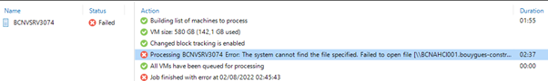
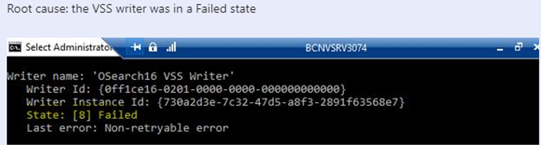
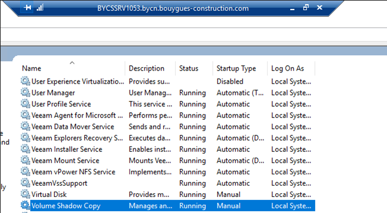

# Veeam issue: Backup job failed due to VSS Writer failed

## Symptom
* Backup Job failed:   
  
   

* Check error on CMD and Event Log of Windows:   

   

* Error message: the VSS writer was in a Failed state

## Cause
* VSS of Windows did not work well in the backup job time.

## Solution
* Restart service VSS and service Osearch 16 
* Relaunch the job

  


## Reference
* Shadow Copy is a technology included in Microsoft Windows that can create backup copies or snapshots of computer files or volumes, even when they are in use. It is implemented as a Windows service called the Volume Shadow Copy service.
* What is [VSS - MS Learn](https://learn.microsoft.com/en-us/windows-server/storage/file-server/volume-shadow-copy-service)
* How to check the Volume Shadow Copy Service (VSS) provider/writer status. [Link](https://www.veritas.com/support/en_US/article.100020300)

```cmd
vssadmin list providers
```
