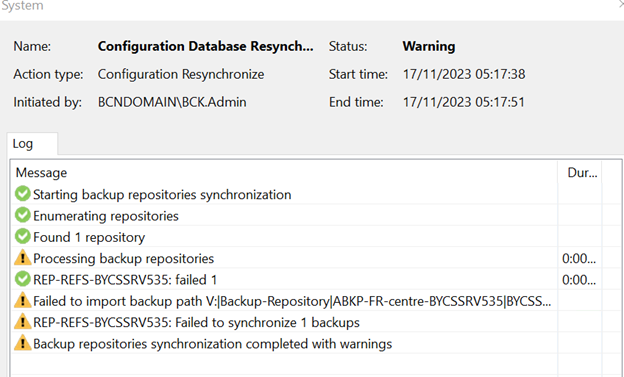
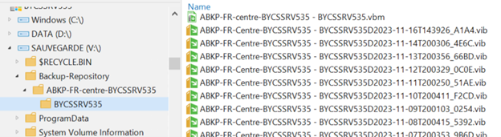
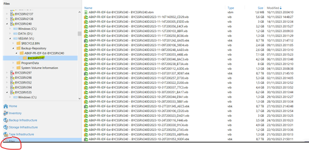
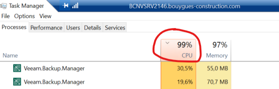

## Symptom
* Backup Job failed error:  when rescan the Repository
  
  


* Error message: 
  
  > Failed to import backup path V:...

* Still able to access disk V from within Veeam Console:  

  
  

## Cause

* The problem is due to the Veeam service on VBR xxxx being stuck (CPU overloaded)

## Solution
* After killing the stucked session and restarting the Veeam service.   
  
  

* End process “Veeam.backup.manager” trong Task Manager

* Or use CLI with Administrator Permission:
* Command to kill veeam service  
  
  ```powershell
  taskkill /F /im Veeam.Backup.Service.exe
  ```

* If above command did not work, then use below:  
  
  ```powershell
  taskkill /F /im Veeam.Backup.Manager.exe
  ```
* Start veeam Backup service in Services Console
* Relaunch the backup job : The backup was successful  