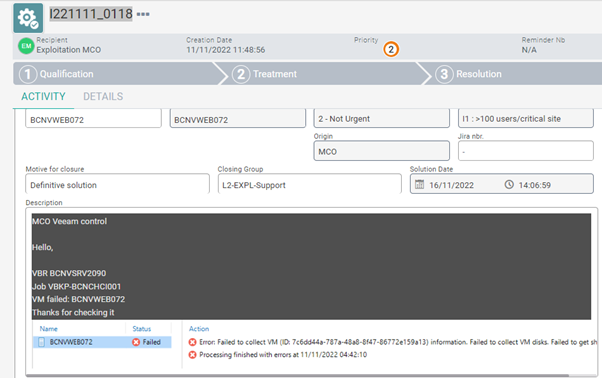
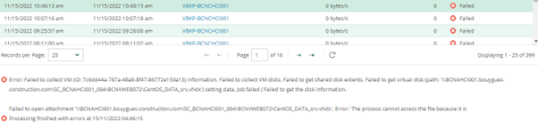
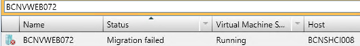
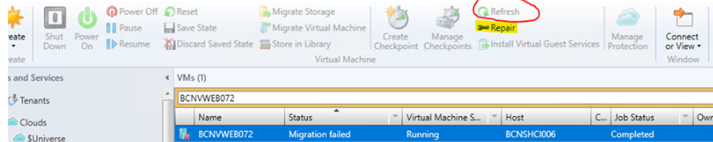
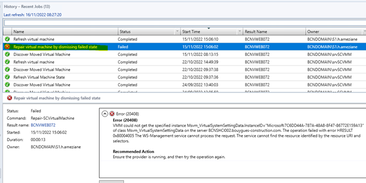

# Veeam issue: Backup job failed due to VM Migration

## Symptom
* Backup Job failed error:  
  
   

   

* Error message: Failed to collect VM information. Failed to collect VM disk...

## Cause

* Backup job failed due to the VM is now in the status " Migration failed " in SCVMM  

   

## Solution
* Repair the VM : The button Refresh is grayed out, so cannot refresh the VM -> We need to repair the VM  

  

  

* Relaunch the backup job  
