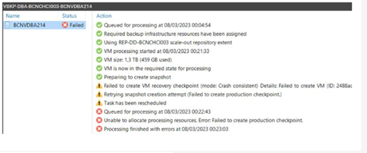
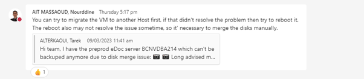
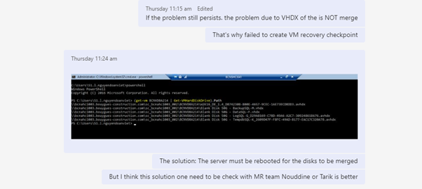

## Symptom
* Backup Job failed error:  
  
  

* Error message: 
  
  > Failed to create VM recovery checkpoint...

## Cause

* The cause of the issue due to the VM is not merge disk automatically

## Solution
* Live migrate the VM to another Host
  
  
  

* If live migrate the VM not fix the issue -> Reboot the VM 
