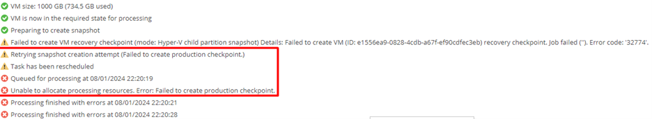
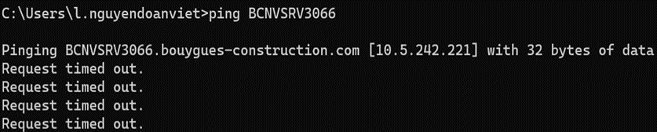
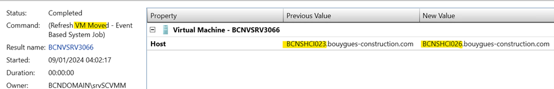
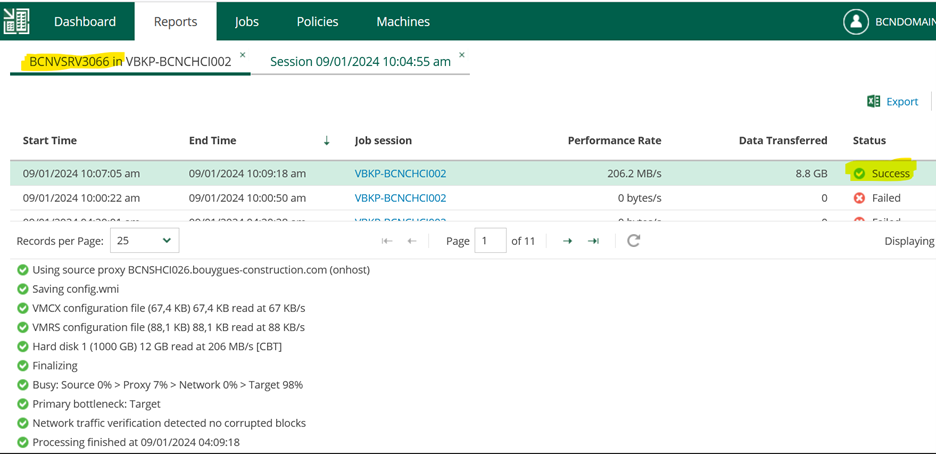

## Symptom
* Backup Job failed error:  
  
  

* Error message: 
  
  > Failed to create production checkpoint ...

## Cause

* On SCVMM -> Server is still running
* But ping failed to that server.
  
  

## Solution
* Live migrate the VM to another Host
  
  
  
  
* Relaunch the job -> Successful.

  