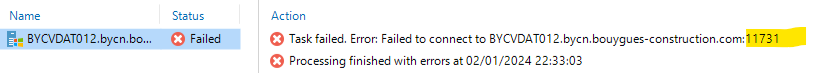

## Symptom
* Backup Job failed error:  
  
  

* Error message: 
  
  > Failed to connect to server - port 11731

## Cause

* This kind of issue 11731 due to the server is unreachable

## Solution

* Make sure the server is reachable again.   
  - check VPN, 
  - Firewall, 
  - status of network at site, 
  - idRAC, 
  - ask local support for help, 
  - migrate VM, 
  - check NIC of VM, etc...
* Relaunch the job -> Successful.