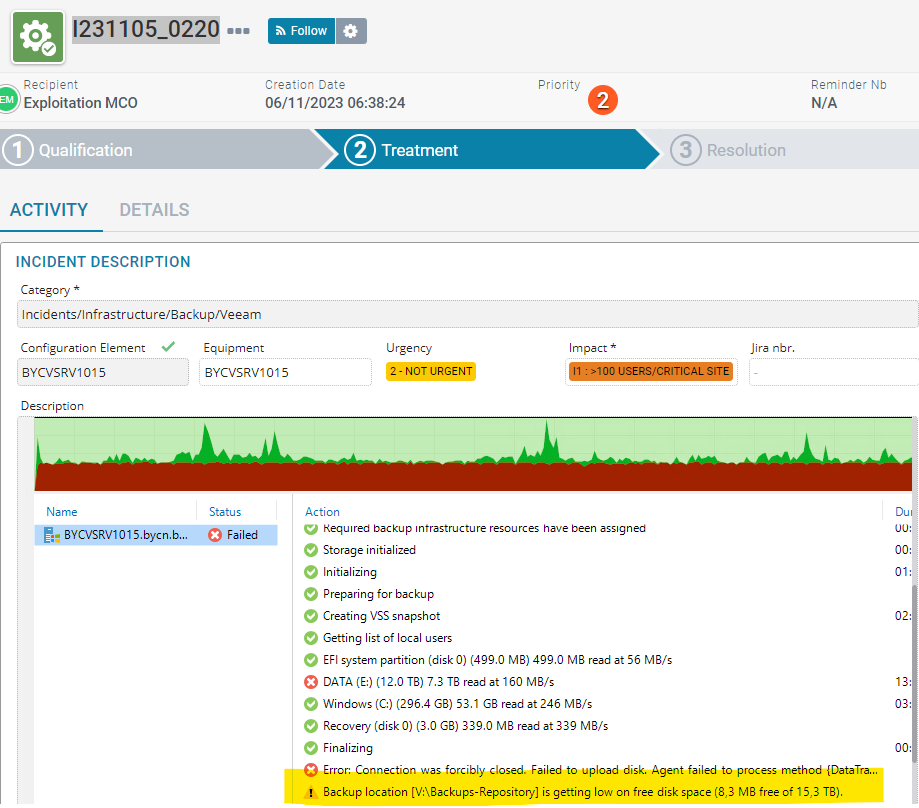
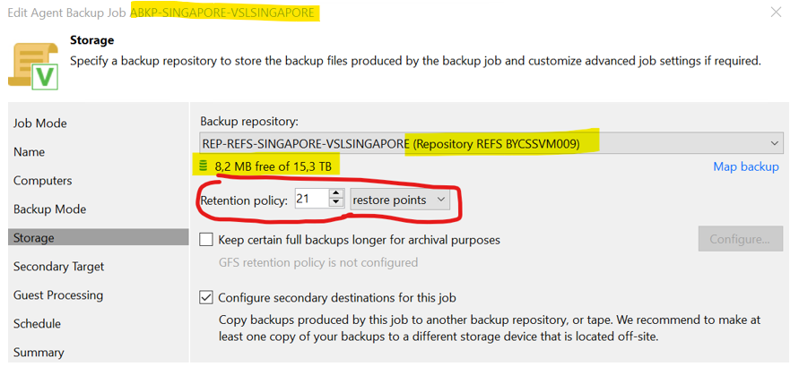
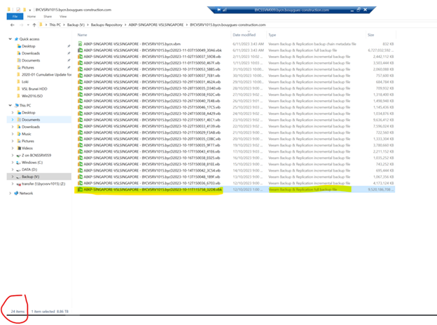

## Symptom
* Backup Job failed error:  
  
  

* Error message: 
  
  >  Failed to upload disk. Agent failed to process method...   
  >  Backup location [...] is getting low on free disk space...

## Cause

* Run out of space on Repository.  
* Go to VBR console  
  Right click the Job -> properties

    

  RDP to Repository BYCSSVM009 to check disk usage on disk V

## Solution

- Delete old backup file out of retention policy
- There are 24 files backup that out of Retention Policy (21). So, delete the oldest full backup file  

  

- Relaunch the backup job.