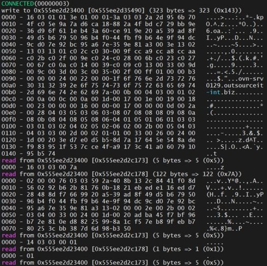

Bên nhà cung cấp đưa cho mình con Draytek 2925fn chỉ để làm router vì mình đã có firewall rồi. Bắt đầu chuyển VPN S2S thông qua đường mới mọi thứ trong rất ổn cho đến khi remote site ko thể kết nối tới bất cứ dịch vụ nào mà có SSL bên trong internal.

## Summary

Chia sẻ cho anh em 1 trường hợp hơi bị chua trong kia sử dụng VPN site to site.
Trước đây mình có chia sẻ về cách thức VPN S2S dùng openVPN, nó vẫn chạy cực kỳ ổn định đến khi bên mình quyết định kéo 1 đường leased line cho video conference.
Bên nhà cung cấp đưa cho mình con Draytek 2925fn chỉ để làm router vì mình đã có firewall rồi. Bắt đầu chuyển VPN S2S thông qua đường mới mọi thứ trong rất ổn cho đến khi remote site ko thể kết nối tới bất cứ dịch vụ nào mà có SSL bên trong internal.

## Symptom

Ping và check gói TCP hoàn toàn bình thường, nhưng không cách nào query được data.

## Cause
* Sai khác giá trị MTU của hai đầu thiết bị.

## Solution

* Tới đây ta biết rằng gói tin đi qua 2 site là ổn, giờ mình sẽ tiến tới layer cao hơn (layer 4).
Kiểm tra kết nối SSL bằng câu lệnh.

```bash
# openssl s_client -connect <server>:636 -debug < /dev/null
```
Trường hợp kết nối bình thường thì bạn sẽ thấy như trong hình mà mình đã attached.



Trường hợp fail thì câu lệnh sẽ treo ở line 0140.  
Đối với trường hợp fail thì server sẽ return error và ko có kết quả nào trả về, cả dịch vụ lỗi hết.
Vui nhất là nếu đổi con router từ Virgor 2925fn sang Vigor 2960 thì hoàn toàn không bị.
Tới đây thì mình ngâm cứu thì phát hiện ra là con 2925 nó có cắt bớt byte trên MTU nên gây ra tình trạng trên.
Tới đây thì đã biết nguyên nhân là gì, bước kế tiếp là kiểm tra con số MTU.

```bash
# ping -s <MTU number> -c 10 <internal server>
```

Sau một hồi thì mình ra được con số là 1358, tới đây thì mình thiết lập thêm 2 options vào openVPN server.
```
tun-mtu 1358;
mssfix 1358;
```
Sau đó chỉ cần restart lại openVPN server.
Cuối cùng thì test SSL từ remote server vào internal server.
Mình thành công trong việc kết nối service từ remote vào internal.  
SLL trả về như mong muốn.


## Reference  

Facebook Group [Quản Trị Mạng và Firewall Cơ Bản](https://www.facebook.com/groups/labccnaccnpfirewall)

