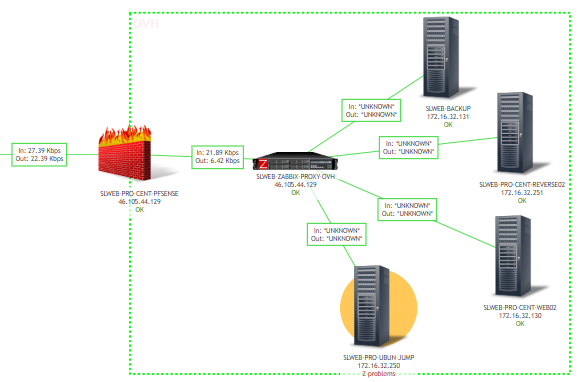

## Symptom
* Trên Zabbix web console, map bị mất thông tin network in out trên đường link. 
  
  


* Thay vì hiện giá trị, thì hiện "Unknow"
* Check các giá trị sau: tương với mỗi server (Edit map > chọn Server > Edit link)
  ```
  In: {?last(/SLWEB-BACKUP/net.if.in["ens32"])}
  Out: {?last(/SLWEB-BACKUP/net.if.out["ens32"])}

  In: {?last(/SLWEB-PRO-CENT-REVERSE02/net.if.in["ens32"])}
  Out: {?last(/SLWEB-PRO-CENT-REVERSE02/net.if.out["ens32"])}

  In: {?last(/SLWEB-PRO-CENT-WEB02/net.if.in["ens32"])}
  Out: {?last(/SLWEB-PRO-CENT-WEB02/net.if.out["ens32"])}

  In: {?last(/SLWEB-PRO-UBUN-JUMP/net.if.in["ens32"])}
  Out: {?last(/SLWEB-PRO-UBUN-JUMP/net.if.out["ens32"])}
  ```
* Check latest trên các Items đó thì không thấy giá trị cập nhật. 

## Cause

* Thông tin không lấy được từ Zabbix-proxy về lưu lượng network.

## Investigation

* Dự đoán nguyên nhân xảy ra với các server ở cùng zone, nên sẽ chỉ cần investigate 1 host, ví dụ investigate host SLWEB-PRO-CENT-WEB02   
Check giá trị hiện tại item **net.if** của host **SLWEB-PRO-CENT-WEB02**   
Lưu ý: các hosts ở zone này được monitor thông qua Zabbix-proxy. (mode: Passive - check on GUI)

* Kiểm tra log kết nối Zabbix Center và Zabbix Proxy:  

  ```
  [root@zabbixvn conf.d]# tail -f /var/log/zabbix/zabbix_server.log | grep -i "zabbix-proxy"   
  2040:20240126:135236.586 ** cannot connect to proxy **"SLWEB-PRO-CENT-ZABBIX-PROXY": cannot connect to [[46.105.44.xxx]:100]: [110] Connection timed out
  2107:20240126:135237.303 In get_value_agent() host:'SLWEB-ZABBIX-PROXY-OVH' addr:'46.105.44.xxx' key:'agent.ping' conn:'unencrypted'
  2106:20240126:135237.312 In get_value_agent() host:'SLWEB-ZABBIX-PROXY-OVH' addr:'46.105.44.xxx' key:'vfs.fs.inode[/,pfree]' conn:'unencrypted'
  ```

* Hiệu chỉnh câu lệnh để tìm log:  

  ```
  [root@zabbixvn conf.d]# tail -f /var/log/zabbix/zabbix_server.log | grep -i -A5 -B5  "cannot connect to proxy"
  2040:20240126:135909.816 cannot connect to proxy "SLWEB-PRO-CENT-ZABBIX-PROXY": cannot connect to [[46.105.44.xxx]:100]: [110] Connection timed out
  2040:20240126:135909.817 End of connect_to_proxy():NETWORK_ERROR

  ```
* Vì không connect được nên kiểm tra cấu hình proxy qua Web GUI, thấy port của proxy cấu hình sai: 100 thay vì 10051 -> hiệu chỉnh

* Kiểm tra lại log lần nữa: 

  ```
  [root@zabbixvn conf.d]# tail -f /var/log/zabbix/zabbix_server.log | grep -i -A5 -B5  "SLWEB-PRO-CENT-ZABBIX-PROXY"
  2040:20240126:142928.484 cannot connect to proxy "SLWEB-PRO-CENT-ZABBIX-PROXY": **TCP successful, cannot establish TLS to **[[46.105.44.xxx]:10051]: cannot connect with TLS and certificate: no valid certificate loaded
  2040:20240126:142928.484 End of connect_to_proxy():NETWORK_ERROR
  2040:20240126:142928.484 End of get_data_from_proxy():NETWORK_ERROR
  ```
* Vì hiện tại không cần mã hóa cho luồng thông tin tới proxy nên tắt encryption (qua GUI).  
* Kiểm tra dữ liệu map đã nhận, map hiện đúng thông tin.   


## Further check  

* (Note: Chú ý các file conf trong thư mục (/etc/httpd/conf.d) cho từng ứng dụng)  
* Kiểm tra Zabbix proxy có lấy được giá trị từ remote host server? Check log, hoặc qua GUI: 

  ```
  2040:20240126:144147.404 obtained data from proxy "SLWEB-PRO-CENT-ZABBIX-PROXY": 
  ```
* Làm thế nào Trigger collect data from Zabbix Server: chờ 5 phút và check lại log, keyword là tên zabbix-proxy 

* Check NAT rules trên pfsense firewall để xem các ports của Zabbix proxy đã được NAT đúng chưa (10051)
* Dùng công cụ ngoài để check port mở chưa [ping.eu](https://ping.eu/port-chk/)
* Dùng tool netcat sẵn có để check remote port opened: 
  ```
  [root@zabbixvn conf.d]# nc -zvw10 46.105.44.xxx 10051
  Ncat: Version 7.70 ( https://nmap.org/ncat )
  Ncat: Connected to 46.105.44.129:10051.
  Ncat: 0 bytes sent, 0 bytes received in 0.20 seconds.
  ```
## Reference  

* Check log to verify connection Zabbix server to Proxy at [Forum](https://www.zabbix.com/forum/zabbix-help/53199-zabbix-server-cant-receive-data-from-my-zabbix-proxy). 
  * The zabbix_sever.log will show you when configuration data is sent to the proxy, which tells the proxy what exactly to monitor. You will see something like this: sending configuration data to proxy "proxy name here". In the proxy you can see if that data was received. Look for "received configuration data from server"