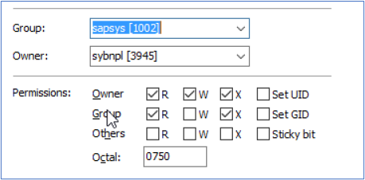
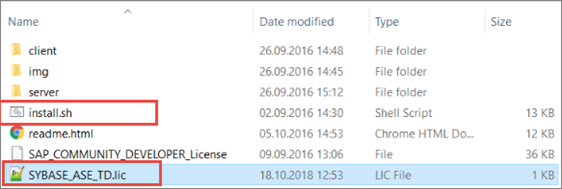

## Symtomp

  Error messsage khi cài SAP Trial system, following this official guide [Installing AS ABAP 7.52 SP04 Developer Edition on VMWare and Linux](https://www.sap.com/documents/2019/09/c86f9218-687d-0010-87a3-c30de2ffd8ff.html)

  ```shell
  ERROR      2024-01-28 22:12:59.767 (root/sapinst) (startInstallation) [CInstallerCallBackImpl.cpp:259] id=ind-rel.ind-os.ind-db.assertionFailed >  errno=CJS-00030 CInstallerCallBackImpl::abortInstallation()
  >  Assertion failed: Unable to generate a new password for database login 'sa'. Refer to trace file sapinst_dev.log for further information.
  ```
  
  Check log details `/tmp/sapinst_instdir/NW73/SBC/STANDARD/sapinst_dev.log` thì thấy message chi tiết như sau:  
  ```shell 
  TRACE      2024-01-28 22:12:59.761 (root/sapinst) (startInstallation)
  syb_start_db_server_reset_sa_password: 00:0000:00000:00000:2024/01/28 22:12:59.75 kernel  There is no valid license for ASE server product. Installation date is not found or installation grace period has expired. Server will not boot.
  ```
  

## Analysis

* Check thông tin License trong file thấy note là đã hết hạn vào 2021:
  ```shell
  cat /sybase/NPL/SYSAM-2_0/licenses/SYBASE_ASE_TestDrive.lic
  ```
  Thông tin được thấy như sau: 
  >  \# ASE Enterprise Edition Trial License for SAP Business Applications   
  >  \# will expire March 31st 2021   
  >  PACKAGE ASE_SAP SYBASE COMPONENTS="ASE_CORE ASE_JAVA ASE_ASM ASE_DIRS \


## Troubleshoot steps

* Không cần tạo license từ trang [sapmini](https://go.support.sap.com/minisap/#/minisap), license cần được download cùng với bộ cài trong trang download, xem thêm post về [Download bộ cài](https://bnmd.github.io/sap-download).

* File license `.lic` cần được đổi tên thành `SYBASE_ASE_TD.lic` và copy vào thư mục `/sybase/NPL/SYSAM-2_0/licenses/` trước khi chạy câu lệnh `install.sh`. Đường dẫn đầy đủ là `/sybase/NPL/SYSAM-2_0/licenses/SYBASE_ASE_TD.lic`

* Tham khảo thêm hướng dẫn đặt file `.lic` trong tài liệu [ASE Demo](https://developers.sap.com/trials-downloads.html?search=ASE+DEMO) : Có 2 cách, chọn 1 trong 2 cách.  

* There are 2 use cases for this license:  
  A. You have already installed an AS ABAP 7.5x version, and just need to update the license.  
  B. You want to install a version of AS ABAP 7.5x, which is not the latest, and for which the ASE license in the .rar files is now obsolete. (For capacity reasons, we cannot update the .rar files of all versions.)
  - Use case A: 
   1.	Replace /sybase/NPL/SYSAM-2_0/licenses/SYBASE_ASE_TestDrive.lic with updated license in shared SAP Documents folder. 
   2.	Assign Linux owners/rights :  

   

  - Use case B:
   1.	Follow the installation instructions in this blog: [Linux for Newbies: Installing ABAP AS 7.50](https://blogs.sap.com/2016/11/03/linux-for-newbies-installing-opensuse-on-oracle-virtualbox/?preview_id=391946). See in particular,  section C, step 13:  
   2. Finally, just before we install, we will ensure that we have the correct ASE license version. To do so, put the new .lic file, which you downloaded in section A above, in the same folder as the script file, using the name SYBASE_ASE_TD.lic . Do this after you have successfully extracted the ABAP .rar files. You do not need to edit the .tar files:   
   
   

## Reference and Notes

* Tham khảo thêm hướng dẫn cài đặt [Complete Installation Guide: 752 VMWare](https://www.sap.com/documents/2019/09/c86f9218-687d-0010-87a3-c30de2ffd8ff.html)

* Một vài lỗi khác về license có thể gặp trong khi cài đặt:

  ```shell
  TRACE      2024-01-29 00:34:10.570 (root/sapinst) (startInstallation)
  syb_start_db_server_reset_sa_password: 00:0000:00000:00000:2024/01/29 00:34:10.56 kernel  SySAM: Licenses exist for ASE, but a license containing the configured (PE=EE;LT=AC) attributes could not be obtained.  
  ```
  Lỗi về license  
  ```shell 
  TRACE      2024-01-28 22:12:59.761 (root/sapinst) (startInstallation)
  syb_start_db_server_reset_sa_password: 00:0000:00000:00000:2024/01/28 22:12:59.75 kernel  There is no valid license for ASE server product. Installation date is not found or installation grace period has expired. Server will not boot.
  ```

  Thông báo lỗi khi cài đặt liên quan đến license, cần tìm các TRACE log ngay trước ERROR log này
  ```shell
  ERROR      2024-01-28 22:12:59.767 (root/sapinst) (startInstallation) [CInstallerCallBackImpl.cpp:259] id=ind-rel.ind-os.ind-db.assertionFailed >  errno=CJS-00030 CInstallerCallBackImpl::abortInstallation()
  Assertion failed: Unable to generate a new password for database login 'sa'. Refer to trace file sapinst_dev.log for further information.
  
  TRACE      2019-02-02 00:02:57.536 (root/sapinst) (startInstallation)
  syb_start_db_server_reset_sa_password: 00:0000:00000:00000:2019/02/02 00:02:57.53 kernel  There is no valid license for ASE server product. Installation date is not found or installation grace period has expired. Server will not boot.
  ```
  
  
* Thông báo nếu không có license được copy vào thư mục đích:
    
  >  No new licenses were copied from /home/alivu/shares/SAP/server/TAR/x86_64 to /sybase/NPL/SYSAM-2_0/licenses
  
* Fake thời gian hệ thống để đánh lừa license cũ đã hết hạn, cách làm này không hiệu quả ( tắt chronyd, set date).

* Nếu gặp lỗi sau đây thì có thể là file license không thể được ghi chồng do đặt ở nhiều nơi cùng lúc, xóa bớt và đảm bảo chỉ có 1 file lic thôi:
  ```shell
  terminate called after throwing an instance of 'EThreadException'  
  what():  ThrMtxUnlock failed: Operating system error occurred.  
  /bas/749_REL/bc_749_REL/src/ins/SAPINST/impl/src/selfextract/iauxsysex.c:387: child /tmp/sapinst_exe.39475.1706488872/sapinst (pid 39476) has crashed. Executable directory is /tmp/sapinst_exe.39475.1706488872. Contact Support.  
  Error: sapinst has finished with an error code, please find logs in /tmp/sapinst_instdir  
  ```

* Câu lệnh để mount share folder vào SUSE từ VMWARE Workstation:
  ```shell
  sudo /usr/bin/vmhgfs-fuse .host:/ /home/alivu/shares -o subtype=vmhgfs-fuse,allow_other
  ```
  
* Log file để check thêm về lỗi cài đặt:

  ```shell
  /tmp/sapinst_instdir/NW73/SBC/STANDARD/sapinst_dev.log
  ```
  
  
  Danh sách toàn bộ các log files:
  
  >  a /tmp/sapinst_exe.24544.1706463135/dev_selfex.out                  
  >  a /tmp/sapinst_instdir/NW73/SBC/STANDARD/cleanipc.1.log             
  >  a /tmp/sapinst_instdir/NW73/SBC/STANDARD/cleanipc.log               
  >  a /tmp/sapinst_instdir/NW73/SBC/STANDARD/control.xml                
  >  a /tmp/sapinst_instdir/NW73/SBC/STANDARD/controllerKdbClient.dmp    
  >  a /tmp/sapinst_instdir/NW73/SBC/STANDARD/date.log                   
  >  a /tmp/sapinst_instdir/NW73/SBC/STANDARD/df.log                     
  >  a /tmp/sapinst_instdir/NW73/SBC/STANDARD/hostname.log               
  >  a /tmp/sapinst_instdir/NW73/SBC/STANDARD/instana.xsl                
  >  a /tmp/sapinst_instdir/NW73/SBC/STANDARD/keydb.xml                  
  >  a /tmp/sapinst_instdir/NW73/SBC/STANDARD/rpm.log                    
  >  a /tmp/sapinst_instdir/NW73/SBC/STANDARD/rsecssfx.log               
  >  a /tmp/sapinst_instdir/NW73/SBC/STANDARD/sapcontrol.1.log           
  >  a /tmp/sapinst_instdir/NW73/SBC/STANDARD/sapcontrol.2.log           
  >  a /tmp/sapinst_instdir/NW73/SBC/STANDARD/sapcontrol.3.log           
  >  a /tmp/sapinst_instdir/NW73/SBC/STANDARD/sapcontrol.log             
  >  a /tmp/sapinst_instdir/NW73/SBC/STANDARD/sapinst.log                
  >  a /tmp/sapinst_instdir/NW73/SBC/STANDARD/sapinst_dev.log            
  >  a /tmp/sapinst_instdir/NW73/SBC/STANDARD/sapinst_loginquirer.log    
  >  a /tmp/sapinst_instdir/NW73/SBC/STANDARD/start_dir.cd               
  >  a /tmp/sapinst_instdir/NW73/SBC/STANDARD/stepKeydbClient.dmp        
  >  a /tmp/sapinst_instdir/NW73/SBC/STANDARD/summary.html               
  >  a /tmp/sapinst_instdir/NW73/SBC/STANDARD/syslib_priv.log            