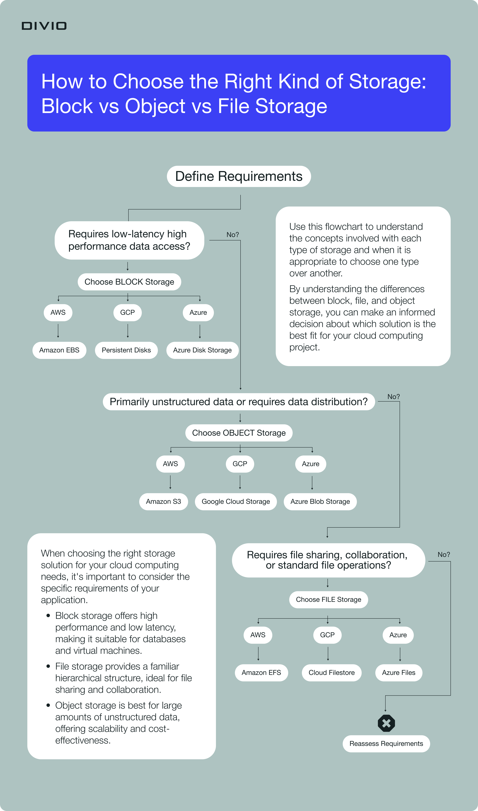

## TLDR 

- Block storage offers high performance and low latency.  
  Suitable for databases and virtual machines.
- File storage provides a familiar hierarchical structure,  
  Ideal for file sharing and collaboration.
- Object storage is offering scalability and cost-effectiveness.  
  Best for large amounts of unstructured data.

## First words

Ba loại lưu trữ dữ liệu phổ biến nhất hiện nay là :  
- File storage 
- Block storage 
- Object storage  

Mỗi loại lưu trữ này có ưu điểm và nhược điểm riêng, và được sử dụng để giải quyết các vấn đề lưu trữ khác nhau.

## File storage là gì?

File storage là quá trình lưu trữ dữ liệu trong một thiết bị hoặc hệ thống lưu trữ điện tử như máy tính, ổ cứng, server, đám mây, hay các thiết bị lưu trữ khác. File storage cho phép người dùng lưu trữ các loại tệp tin như văn bản, hình ảnh, âm thanh, video, tài liệu, và các loại dữ liệu khác.

Các hệ thống lưu trữ file thường được tổ chức và quản lý để giúp người dùng tìm kiếm, truy cập, chia sẻ, sao lưu và bảo vệ dữ liệu của mình. Các công nghệ lưu trữ file hiện nay bao gồm các hệ thống lưu trữ đám mây, ổ cứng ngoài, NAS (Network Attached Storage), SAN (Storage Area Network) và các loại hệ thống lưu trữ khác.

## Cách File storage hoạt động

File storage hoạt động bằng cách lưu trữ các tệp tin dữ liệu vào các thiết bị hoặc hệ thống lưu trữ điện tử. Khi người dùng tạo hoặc tải lên một tệp tin vào hệ thống lưu trữ, tệp tin đó sẽ được phân bổ một vị trí địa chỉ trong hệ thống lưu trữ. Vị trí địa chỉ này sẽ được lưu trong hệ thống quản lý cơ sở dữ liệu của hệ thống lưu trữ.

Khi người dùng muốn truy cập tệp tin đã lưu trữ, họ có thể sử dụng các giao diện hoặc ứng dụng để tìm kiếm và truy cập tệp tin đó. Hệ thống lưu trữ sẽ sử dụng địa chỉ đã lưu trữ để truy cập tệp tin và trả về cho người dùng.

Các hệ thống lưu trữ file thường có tính năng bảo vệ dữ liệu, cho phép người dùng sao lưu tệp tin để đảm bảo an toàn dữ liệu trong trường hợp xảy ra sự cố. Ngoài ra, hệ thống lưu trữ file còn cung cấp các tính năng khác như chia sẻ tệp tin cho người dùng khác, cấu hình quyền truy cập, và lịch sử sửa đổi tệp tin.

## Ưu và nhược điểm của File storage

Ưu điểm của File storage:

- Dễ sử dụng: File storage là một giải pháp lưu trữ dữ liệu đơn giản và dễ sử dụng cho người dùng cá nhân, các doanh nghiệp và tổ chức.
- Truy cập dữ liệu từ xa: Với các dịch vụ lưu trữ đám mây, người dùng có thể truy cập dữ liệu của mình từ bất cứ đâu với kết nối Internet.
- Dữ liệu được bảo vệ: File storage cung cấp tính năng bảo vệ dữ liệu như sao lưu dữ liệu, mã hóa dữ liệu và kiểm soát truy cập để đảm bảo an toàn và bảo mật dữ liệu.
- Dễ dàng chia sẻ dữ liệu: Người dùng có thể chia sẻ dữ liệu của mình với người dùng khác trong cùng một hệ thống lưu trữ file, giúp tăng tính hiệu quả và cộng tác trong công việc.
- Phù hợp với nhiều loại dữ liệu: File storage cho phép lưu trữ nhiều loại dữ liệu như hình ảnh, video, tài liệu văn bản, âm thanh và các loại tệp tin khác.

Nhược điểm của File storage:

- Tốc độ truy cập dữ liệu: Việc truy cập dữ liệu trong hệ thống lưu trữ file có thể chậm hơn so với truy cập trực tiếp vào các thiết bị lưu trữ như ổ đĩa cứng.
- Phụ thuộc vào kết nối mạng: Các dịch vụ lưu trữ đám mây yêu cầu kết nối mạng ổn định để truy cập dữ liệu, nếu kết nối mạng bị gián đoạn hoặc chậm có thể ảnh hưởng đến truy cập dữ liệu.
- Chi phí sử dụng: Một số dịch vụ lưu trữ đám mây và hệ thống lưu trữ file có chi phí sử dụng cao, đặc biệt là đối với các doanh nghiệp và tổ chức có nhu cầu lưu trữ lớn.
- Rủi ro về bảo mật: Việc lưu trữ dữ liệu trong các hệ thống lưu trữ file và đám mây có thể có rủi ro về bảo mật, đặc biệt là khi dữ liệu được truyền qua mạng hoặc khi lưu trữ trên các máy chủ bên ngoài.

## Block storage là gì?

Block storage là một dạng lưu trữ dữ liệu trong đó dữ liệu được phân chia thành các khối (block) có kích thước nhất định và được lưu trữ trên các thiết bị lưu trữ như ổ đĩa cứng, ổ đĩa SSD hoặc các thiết bị lưu trữ mạng (SAN). Khối dữ liệu trong block storage được truy cập thông qua các địa chỉ duy nhất được gọi là "địa chỉ block", và các khối này có thể được sắp xếp và đọc ghi một cách độc lập nhau.

Block storage thường được sử dụng trong các ứng dụng yêu cầu tốc độ truy xuất dữ liệu nhanh như cơ sở dữ liệu hoặc các ứng dụng yêu cầu lưu trữ dữ liệu lớn và truy xuất dữ liệu dưới dạng ngẫu nhiên như các ứng dụng máy chủ.

Block storage cung cấp tính năng linh hoạt về việc phân chia và quản lý dữ liệu, cho phép người dùng tăng hoặc giảm dung lượng lưu trữ dựa trên nhu cầu thực tế của họ. Ngoài ra, block storage cũng cung cấp tính năng bảo mật dữ liệu bằng cách sử dụng các công nghệ mã hóa và các tính năng kiểm soát truy cập để đảm bảo an toàn và bảo mật dữ liệu.
Cách Block storage hoạt động

Block storage hoạt động bằng cách phân chia dữ liệu thành các khối (block) có kích thước nhất định và lưu trữ chúng trên các thiết bị lưu trữ như ổ đĩa cứng, ổ đĩa SSD hoặc các thiết bị lưu trữ mạng (SAN). Mỗi khối dữ liệu có một địa chỉ duy nhất, được gọi là "địa chỉ block", để truy cập và xử lý dữ liệu.

Khi người dùng yêu cầu truy cập dữ liệu từ block storage, hệ thống sẽ sử dụng địa chỉ block để xác định vị trí lưu trữ của khối dữ liệu tương ứng và truy xuất nó từ thiết bị lưu trữ. Việc truy xuất khối dữ liệu có thể được thực hiện một cách độc lập, cho phép người dùng truy xuất dữ liệu ở bất kỳ vị trí nào trên thiết bị lưu trữ một cách nhanh chóng và hiệu quả.

Khi người dùng cần thêm dung lượng lưu trữ, họ có thể thêm mới các khối dữ liệu vào block storage và cấu hình hệ thống để sử dụng chúng. Ngược lại, khi người dùng không cần sử dụng một số khối dữ liệu nào đó, họ có thể xóa chúng để giảm dung lượng lưu trữ.

Các hệ thống block storage thường hỗ trợ các tính năng bảo mật dữ liệu như mã hóa và kiểm soát truy cập để đảm bảo an toàn và bảo mật dữ liệu. Ngoài ra, block storage cũng hỗ trợ các tính năng quản lý và sao lưu dữ liệu để đảm bảo tính sẵn sàng và độ tin cậy của hệ thống lưu trữ.

## Ưu và nhược điểm của Block storage

Ưu điểm của Block storage:

- Tốc độ truy xuất nhanh: Block storage cho phép truy xuất dữ liệu với tốc độ nhanh hơn so với các loại lưu trữ khác. Việc phân chia dữ liệu thành các khối giúp cho người dùng có thể truy xuất dữ liệu nhanh chóng và hiệu quả.
- Linh hoạt trong việc quản lý dữ liệu: Block storage cung cấp tính năng linh hoạt trong việc quản lý dữ liệu, cho phép người dùng tăng hoặc giảm dung lượng lưu trữ dựa trên nhu cầu thực tế của họ.
- Độ tin cậy cao: Block storage cung cấp các tính năng bảo mật và quản lý dữ liệu để đảm bảo tính sẵn sàng và độ tin cậy của hệ thống lưu trữ.
- Khả năng mở rộng dễ dàng: Block storage cho phép người dùng mở rộng dung lượng lưu trữ bằng cách thêm mới các thiết bị lưu trữ hoặc thêm mới các khối dữ liệu vào hệ thống.

Nhược điểm của Block storage:

- Giá thành cao: Block storage thường có giá thành cao hơn so với các loại lưu trữ khác.
- Khó khăn trong việc quản lý: Block storage yêu cầu kiến thức chuyên môn và kỹ năng quản lý để sử dụng và bảo trì.
- Không thể chia sẻ dữ liệu: Block storage không cho phép chia sẻ dữ liệu giữa các người dùng và các ứng dụng khác nhau.
- Không thể truy cập dữ liệu từ xa: Block storage thường không cho phép truy cập dữ liệu từ xa, nếu muốn truy cập dữ liệu, người dùng cần phải truy cập trực tiếp vào thiết bị lưu trữ.

## Object storage là gì?

Object storage là một phương thức lưu trữ dữ liệu phân tán, trong đó dữ liệu được lưu trữ và quản lý dưới dạng các đối tượng (object) độc lập. Mỗi đối tượng chứa dữ liệu, metadata và một định danh (identifier) duy nhất để phân biệt với các đối tượng khác trong hệ thống.

Object storage cung cấp một phương thức lưu trữ phân tán và độc lập với phần cứng, giúp tăng tính sẵn sàng và độ tin cậy của hệ thống lưu trữ. Đồng thời, nó cũng cho phép truy xuất dữ liệu từ bất kỳ đâu thông qua các giao thức như HTTP hoặc HTTPS.

Một điểm khác biệt quan trọng của object storage so với block storage và file storage là khả năng tự động mở rộng, nghĩa là khi dung lượng lưu trữ tăng lên, hệ thống tự động tạo thêm các bản sao dữ liệu và phân phối chúng đến các máy chủ khác nhau trong hệ thống. Việc này giúp đảm bảo tính sẵn sàng và khả năng phục hồi sau sự cố.

Object storage thường được sử dụng cho các ứng dụng lưu trữ dữ liệu lớn như hình ảnh, video, âm thanh, tài liệu và các ứng dụng trên đám mây.

## Cách Object storage hoạt động

Object storage hoạt động bằng cách lưu trữ dữ liệu dưới dạng các đối tượng độc lập, mỗi đối tượng chứa dữ liệu, metadata và một định danh duy nhất để phân biệt với các đối tượng khác trong hệ thống.

Khi người dùng yêu cầu truy xuất đến một đối tượng, hệ thống object storage sẽ sử dụng định danh để tìm kiếm và truy xuất đến đối tượng tương ứng. Tại thời điểm này, hệ thống sẽ trả về dữ liệu cho người dùng theo yêu cầu.

Khi người dùng thêm mới hoặc sửa đổi một đối tượng, hệ thống sẽ tạo ra một bản sao mới của đối tượng và phân phối nó đến các máy chủ khác nhau trong hệ thống để đảm bảo tính sẵn sàng và độ tin cậy của hệ thống lưu trữ. Việc này giúp đảm bảo tính toàn vẹn và khả năng phục hồi dữ liệu sau sự cố.

Hệ thống object storage cung cấp một giao diện API để cho phép người dùng tương tác với các đối tượng, tạo mới, sửa đổi, xoá và truy xuất dữ liệu. Object storage cũng hỗ trợ nhiều giao thức truy cập như HTTP, HTTPS, S3, Swift, NFS và SMB để đảm bảo tính linh hoạt và tương thích với các ứng dụng khác nhau.

Một số hệ thống object storage cũng cung cấp các tính năng bảo mật và quản lý dữ liệu để đảm bảo tính sẵn sàng và độ tin cậy của hệ thống lưu trữ.

## Ưu và nhược điểm của Object storage

Ưu điểm của Object storage:

- Khả năng lưu trữ và quản lý dữ liệu lớn: Object storage cho phép lưu trữ và quản lý dữ liệu lớn một cách hiệu quả. Không giống như block storage hoặc file storage, object storage có thể lưu trữ hàng tỷ hoặc thậm chí hàng trăm tỷ đối tượng một cách dễ dàng.
- Tính toàn vẹn và khả năng phục hồi dữ liệu: Object storage có khả năng tự động tạo ra các bản sao của dữ liệu và phân phối chúng đến các máy chủ khác nhau trong hệ thống. Việc này giúp đảm bảo tính toàn vẹn và khả năng phục hồi dữ liệu sau sự cố.
- Tính sẵn sàng và độ tin cậy: Hệ thống object storage được phân tán trên nhiều máy chủ khác nhau, giúp đảm bảo tính sẵn sàng và độ tin cậy của hệ thống lưu trữ.
- Khả năng mở rộng linh hoạt: Object storage có khả năng mở rộng linh hoạt, khi nhu cầu lưu trữ tăng lên, hệ thống tự động tạo thêm các bản sao dữ liệu và phân phối chúng đến các máy chủ khác nhau trong hệ thống.
- Tính tương thích và tính linh hoạt: Object storage hỗ trợ nhiều giao thức truy cập như HTTP, HTTPS, S3, Swift, NFS và SMB để đảm bảo tính tương thích và tính linh hoạt với các ứng dụng khác nhau.

Nhược điểm của Object storage:

- Tốc độ truy cập chậm hơn so với block storage hoặc file storage: Object storage thường có tốc độ truy cập chậm hơn so với block storage hoặc file storage, do quá trình truy xuất đến dữ liệu phải thông qua nhiều lớp phần mềm và phải tìm kiếm dữ liệu dựa trên định danh.
- Chi phí cao hơn so với các phương pháp lưu trữ khác: Object storage có chi phí cao hơn so với các phương pháp lưu trữ khác, do yêu cầu các hệ thống phân tán phức tạp hơn và các bản sao dữ liệu được tạo ra để đảm bảo tính sẵn sàng và độ tin cậy của hệ thống lưu trữ.
- Không thích hợp cho các ứng dụng yêu cầu tốc độ truy cập cao và tối ưu hóa cho hiệu suất: Object storage không phù hợp cho các ứng dụng yêu cầu tốc độ truy cập dữ liệu cao và tối ưu hóa cho hiệu suất, ví dụ như các ứng dụng cần xử lý và truy vấn dữ liệu liên tục.
- Khó khăn trong việc xử lý dữ liệu có kích thước lớn: Object storage không thích hợp cho việc xử lý dữ liệu có kích thước lớn. Khi các tệp dữ liệu rất lớn được lưu trữ trong object storage, việc truy xuất hoặc xử lý dữ liệu có thể trở nên chậm chạp hoặc gây ra sự cố.
- Khó khăn trong việc tích hợp và quản lý: Vì object storage thường được triển khai trong các môi trường phân tán phức tạp, việc tích hợp và quản lý hệ thống lưu trữ có thể trở nên khó khăn và phức tạp hơn so với các phương pháp lưu trữ khác.
- Bảo mật dữ liệu có thể bị đe dọa: Việc lưu trữ dữ liệu trong object storage có thể tạo ra các vấn đề bảo mật dữ liệu, đặc biệt là khi các đối tượng được lưu trữ có giá trị cao và chứa thông tin nhạy cảm của khách hàng hoặc doanh nghiệp.

## So sánh File storage, block storage và object storage

Dưới đây là một số điểm khác nhau giữa File storage, Block storage và Object storage:

Cấu trúc dữ liệu:
- File storage: Lưu trữ dữ liệu theo dạng file, được quản lý trên hệ thống tập tin.
- Block storage: Lưu trữ dữ liệu theo dạng các block dữ liệu có kích thước cố định.
- Object storage: Lưu trữ dữ liệu dưới dạng các đối tượng, mỗi đối tượng chứa cả dữ liệu và các siêu dữ liệu để mô tả thông tin về đối tượng.

Phân phối:
- File storage: Thường được triển khai trên các hệ thống đơn giản, và không phân tán.
- Block storage: Thường được triển khai trên các hệ thống phân tán.
- Object storage: Thường được triển khai trên các hệ thống phân tán quy mô lớn.

Hiệu suất:
- File storage: Thích hợp cho các ứng dụng yêu cầu truy cập dữ liệu ngẫu nhiên.
- Block storage: Thích hợp cho các ứng dụng yêu cầu hiệu suất cao.
- Object storage: Thích hợp cho các ứng dụng lưu trữ dữ liệu lớn và không yêu cầu tốc độ truy cập cao.

Quản lý:
- File storage: Dễ dàng quản lý và triển khai, tuy nhiên có thể gặp khó khăn khi quản lý các tệp dữ liệu lớn.
- Block storage: Khó khăn trong việc quản lý và triển khai, tuy nhiên cung cấp khả năng tùy chỉnh cao và hiệu suất tốt.
- Object storage: Cung cấp khả năng mở rộng linh hoạt, tuy nhiên có thể gặp khó khăn trong việc tích hợp và quản lý hệ thống.  

Bảo mật:
- File storage: Có khả năng bảo mật tệp dữ liệu.
- Block storage: Có khả năng bảo mật dữ liệu tốt.
- Object storage: Có thể gặp vấn đề bảo mật khi lưu trữ dữ liệu nhạy cảm.

## Nên chọn File storage, block storage hay object storage?

Việc chọn File storage, Block storage hay Object storage sẽ phụ thuộc vào nhu cầu và yêu cầu của ứng dụng của bạn. Dưới đây là một số lời khuyên để giúp bạn quyết định:
- Nếu ứng dụng của bạn cần truy cập dữ liệu ngẫu nhiên và đang sử dụng các tệp dữ liệu cơ bản, bạn nên sử dụng File storage.
- Nếu ứng dụng của bạn cần hiệu suất cao và khả năng mở rộng tốt, bạn nên sử dụng Block storage.
- Nếu ứng dụng của bạn cần lưu trữ và quản lý dữ liệu lớn, và không cần tốc độ truy cập cao, bạn nên sử dụng Object storage.
- Nếu ứng dụng của bạn đang xây dựng trên nền tảng điện toán đám mây, hầu hết các nhà cung cấp đám mây đều cung cấp cả ba loại lưu trữ này. Bạn có thể sử dụng một hoặc nhiều loại lưu trữ tùy thuộc vào nhu cầu của ứng dụng.
- Nếu ứng dụng của bạn cần tính linh hoạt cao, bạn có thể sử dụng cả ba loại lưu trữ để tận dụng các ưu điểm của mỗi loại.

Tóm lại, việc chọn loại lưu trữ nào phù hợp nhất phụ thuộc vào nhu cầu và yêu cầu của ứng dụng của bạn. Bạn nên đánh giá kỹ các yếu tố khác nhau và chọn loại lưu trữ phù hợp để đảm bảo hiệu suất và độ tin cậy của ứng dụng của mình.

## Kết luận

Tóm lại, File storage, Block storage và Object storage đều là các phương pháp lưu trữ dữ liệu phổ biến được sử dụng trong công nghệ thông tin. Mỗi loại lưu trữ này có ưu và nhược điểm riêng, và được sử dụng để giải quyết các vấn đề lưu trữ khác nhau.

- File storage phù hợp cho việc lưu trữ các tập tin nhỏ, có thể truy cập ngẫu nhiên, và được sử dụng chủ yếu cho các ứng dụng file sharing và hệ thống tập tin.
- Block storage phù hợp cho việc lưu trữ các dữ liệu có kích thước lớn, cần độ tin cậy cao và hiệu suất cao, được sử dụng chủ yếu cho các hệ thống lưu trữ cơ sở dữ liệu và ứng dụng yêu cầu hiệu suất cao.
- Object storage phù hợp cho việc lưu trữ các dữ liệu lớn, phân tán, không cần truy cập ngẫu nhiên và yêu cầu tính sẵn sàng cao. Được sử dụng chủ yếu cho việc lưu trữ các file multimedia, dữ liệu lưu trữ web, hoặc các tệp dữ liệu có độ lớn lớn.

Tuy nhiên, quyết định chọn loại lưu trữ phù hợp nhất phải dựa trên nhu cầu và yêu cầu cụ thể của ứng dụng của bạn. Nếu bạn không chắc chắn, nên tìm hiểu kỹ và tham khảo các chuyên gia hoặc tài liệu trước khi chọn loại lưu trữ phù hợp.

## Reference
- Cloudz article: [Nên chọn File Storage, Block Storage hay Object Storage để lưu dữ liệu?](https://cloud.z.com/vn/news/file-storage/)
- Vietnix article: [File storage, block storage và object storage là gì?](https://vietnix.vn/file-storage-block-storage-va-object-storage-la-gi/)
- Divio:[Link](https://www.divio.com/blog/cloud-storage-file-block-object/)
