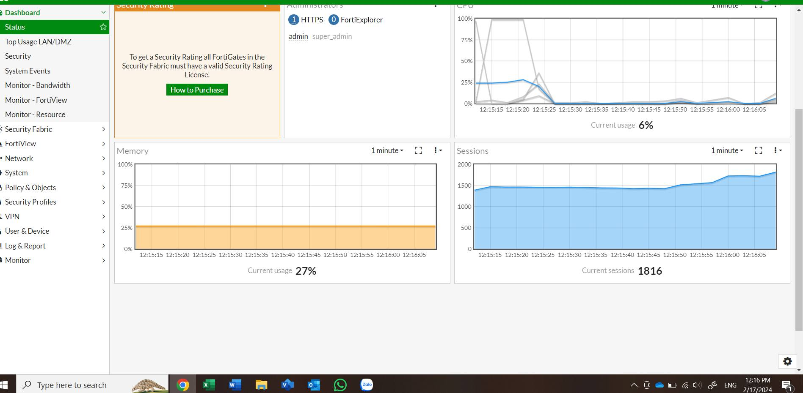

## Summary

* Nhận thây Mạng chậm bất thường (do linh cảm chăng?) kiểm tra status của Firewall Fortigate 100D thì phát hiện Session cao bất thường.

## Symptom
* Mạng chậm
* Nhiệt độ trong không khí tăng cao (do con Fortigate hay sao ấy nhi)
* Bà xã khó chịu, thăng con cũng ê a, có điềm.

## Cause
* Do một vài con điện thoaại có hành vi bất thường gửi tin lung tung.
* Check session và traffic thì thấy như sau, y rằng:

## Solution
* Block Destination của nó thôi, hoa ra là con Oppo hàng tàu lạ.
* Block trước giải trình sau.

## Next steps
* Rà soát lại một loạt điện thoại tàu trong LAN.
* Có thiết bị nó fake tên, lưu ý.
* Thay firewall fortigate bằng con to hơn cho thong thả.
* Block MAC của Camera ra Internet.
* Giới hạn cho mỗi user tầm 2Mbps thôi, đủ xem 1 luồng/1user cho camera.

